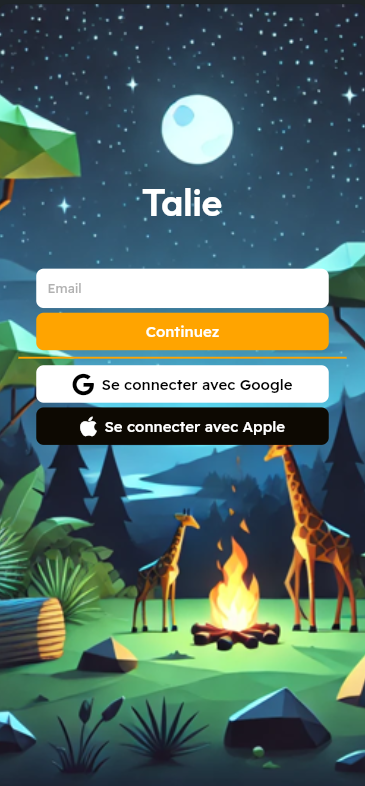
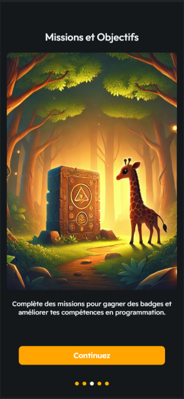
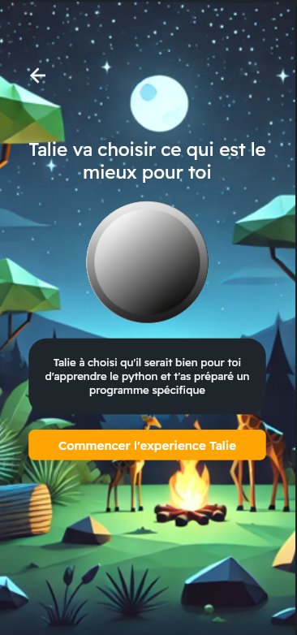
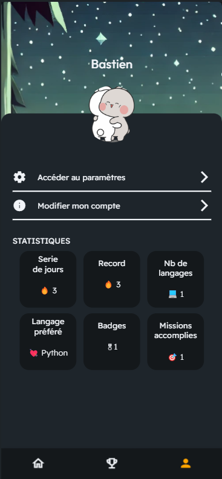
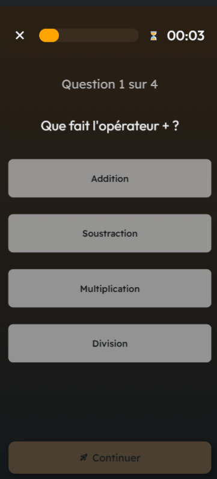
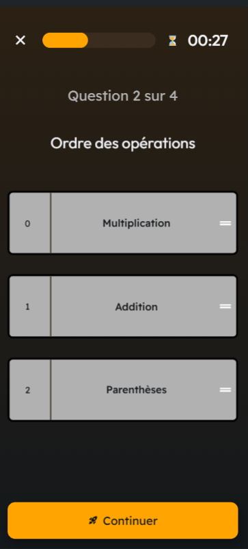
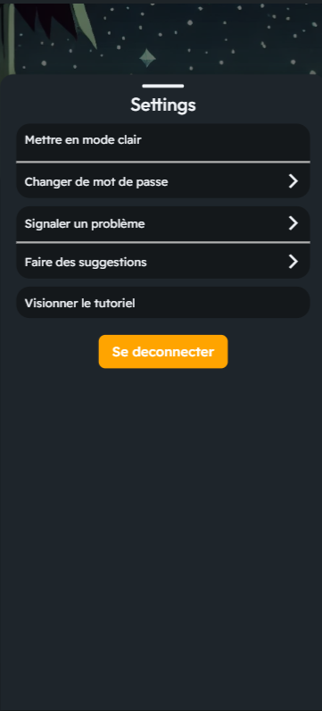

# 🎓 Talie – Projet de fin d'études (Epitech)

**Talie** est une application mobile développée dans le cadre de mon projet de fin d’études à Epitech.  
C’est une solution interactive qui vise à accompagner les utilisateurs dans la réalisation d’exercices personnalisés, avec un suivi de progression, une composante d’intelligence artificielle et une UX simple et intuitive.

Je suis **chef de projet** sur Talie : j’ai encadré les étapes clés du développement, de la conception à la mise en œuvre, en dirigeant les choix techniques, l’organisation et la répartition des tâches.

---

## 🧠 Objectif du projet

Créer une application mobile centrée utilisateur, combinant :
- Suivi de parcours personnalisé
- Sélection dynamique d’exercices
- Interface claire, intuitive et moderne
- Intégration d’une logique d’IA pour adapter les contenus proposés

---

## 🛠️ Stack technique

- **Flutter** pour le développement mobile (cross-platform)
- **Dart** comme langage principal
- **Firebase** pour l’authentification et la gestion des données utilisateurs
- Architecture basée sur une séparation claire entre logique métier et UI

---

## 🖼️ Aperçu de l’application

| Écran de connexion | Onboarding | Sélection IA |
|--------------------|------------|--------------|
|  |  |  |

Autres captures :
- 
- 
- 
- 
- 

---

## 📌 Fonctionnalités principales

- Connexion sécurisée
- Onboarding guidé
- Création d’un profil utilisateur
- Génération dynamique d’exercices
- Choix guidé par IA
- Suivi de progression
- Badges de motivation
- Paramètres personnalisables

---

## 👨‍💻 Mon rôle

- **Chef de projet** : définition des objectifs, roadmap, organisation du travail  
- Conception complète de l’application (UX/UI + logique technique)  
- Développement frontend avec Flutter  
- Encadrement des choix techniques et itérations produit  
- Tests utilisateurs & ajustements  
- Présentation finale dans le cadre du diplôme Epitech

---

## 🚀 Ce que ce projet m’apporte

- Travailler sur un projet long terme de A à Z  
- Développer mes compétences de **gestion de projet technique**  
- Approfondir Flutter, Firebase, UX et organisation produit  
- Encadrer une équipe et prendre des décisions techniques clés