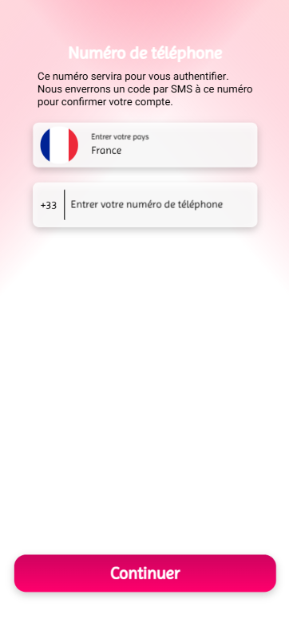
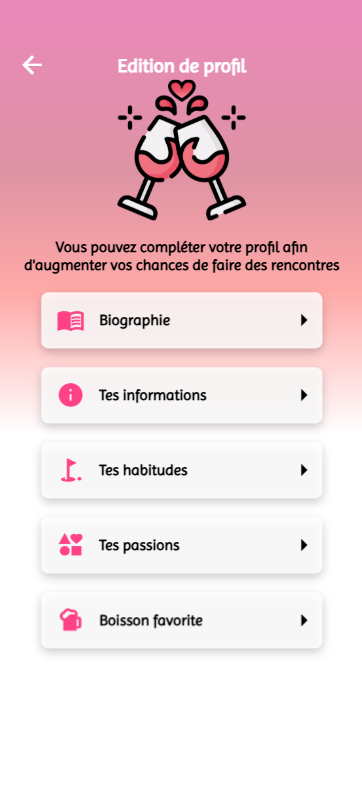
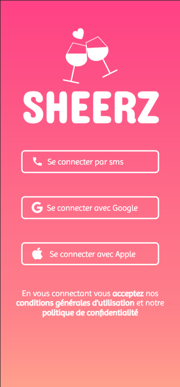
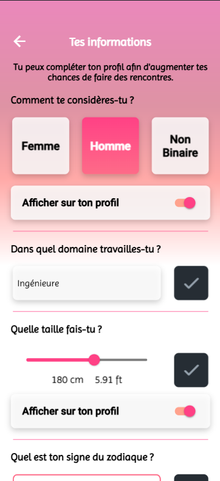
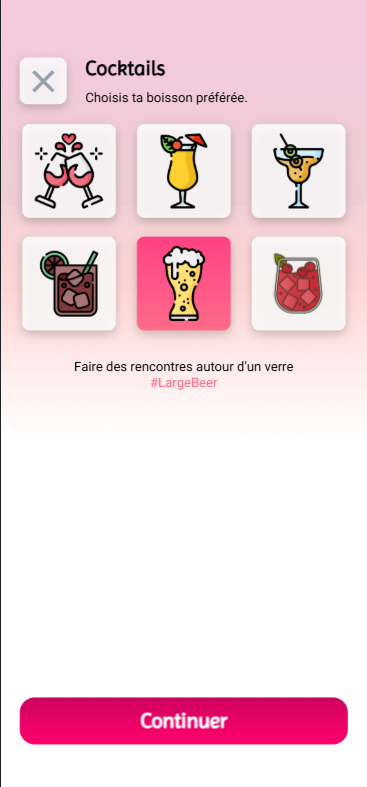
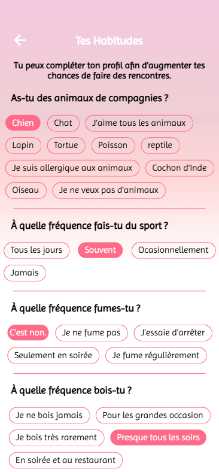

# 📱 Vybees – Application mobile de rencontre (Stage Flutter)

Application mobile développée durant mon stage chez **Vybees**, une startup ayant pour objectif de créer un concept innovant de rencontre sociale autour des préférences de consommation (ex : boissons, goûts, lieux, etc.).

J’ai été en charge du projet **de A à Z**, en tant que **développeur principal et chef de projet technique**. L'application a été entièrement pensée, conçue et développée par moi, avec l'encadrement d’un autre développeur à qui j'ai attribué les tâches et fixé les deadlines.

---

## 🎯 Objectifs de l’application

- Créer un profil personnalisé basé sur les préférences (ex : boisson favorite)
- Permettre aux utilisateurs de se rencontrer via un système de matching
- Offrir une interface fluide, intuitive et moderne
- Créer une base solide pour un MVP (produit minimum viable)

---

## 🛠️ Stack technique

- **Flutter** pour le développement mobile cross-platform  
- **Dart** pour la logique applicative  
- **Firebase** pour l’authentification, la base de données et le stockage  
- Gestion d’état via Provider / setState  
- Architecture modulaire et évolutive

---

## 🖼️ Aperçu de l'application

| Connexion | Profil utilisateur | Paramètres |
|----------|--------------------|------------|
|  |  |  |

Autres écrans :
- 
- 
- 
- 

---

## 📌 Fonctionnalités principales

- Connexion par téléphone / méthode personnalisée  
- Création de profil avec préférences  
- Interface responsive et fluide  
- Paramétrage du compte  
- Architecture prête pour intégrer un système de matching

---

## 👨‍💻 Mon rôle

- **Chef de projet technique** : planification, organisation du travail, encadrement d’un développeur  
- Conception des maquettes (Figma) et de l’expérience utilisateur  
- Développement complet en Flutter  
- Intégration Firebase (auth, firestore, storage)  
- Tests, itérations et amélioration continue

---

## ✅ Ce que ce projet m’a apporté

- Expérience concrète en startup avec beaucoup d’autonomie  
- Approfondissement de Flutter & Firebase  
- Gestion de projet et encadrement technique  
- Sens produit et logique MVP
