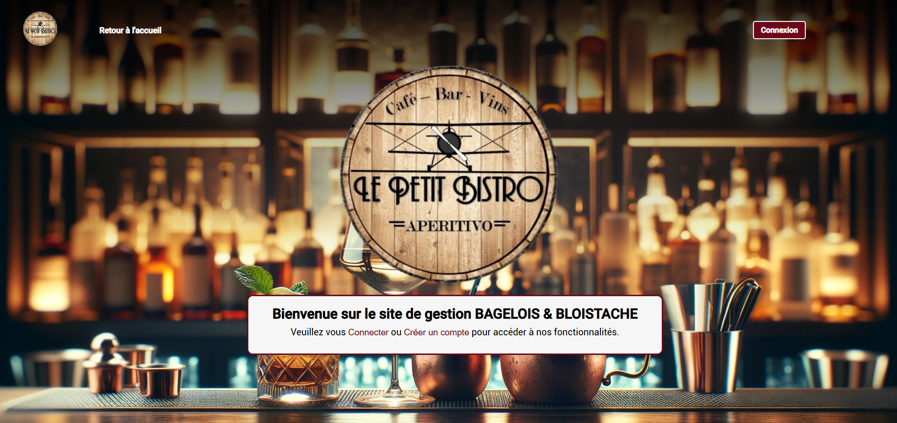
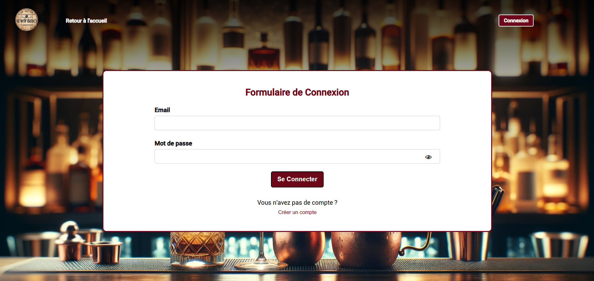
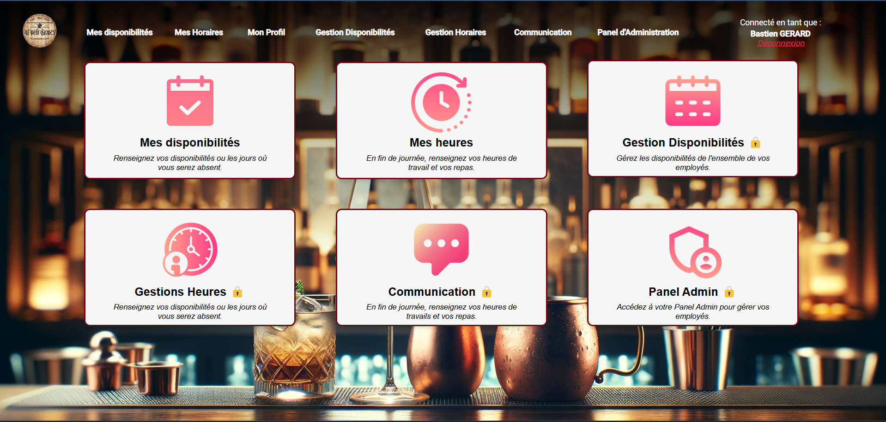
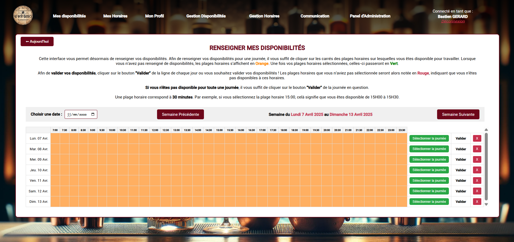
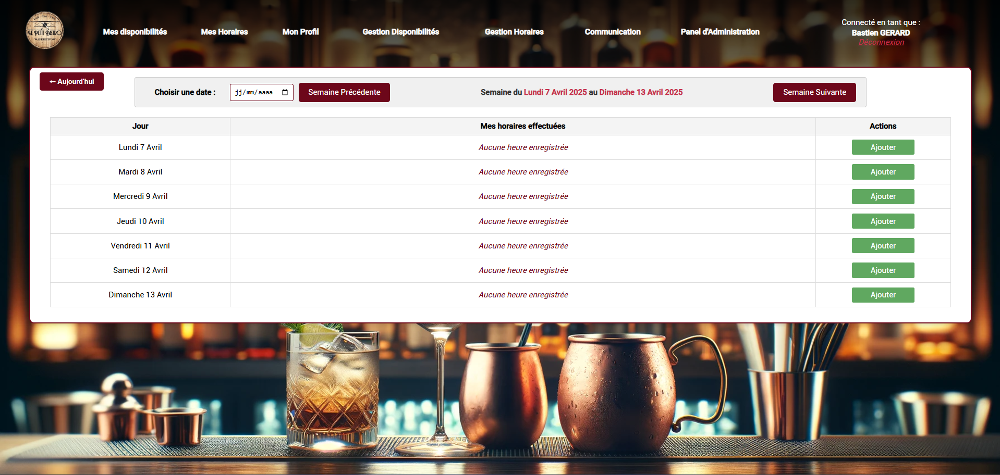
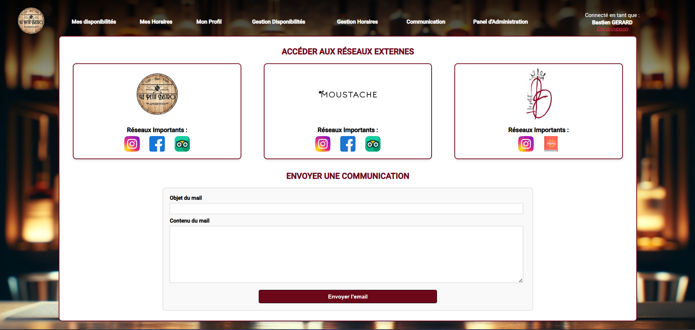

# 🍽️ Web App – Restaurant Management

Application web réalisée pour un restaurant local, dans un contexte personnel/professionnel.  
L’objectif était de fournir un outil simple et intuitif pour la **gestion des réservations, des horaires et des disponibilités**, tout en offrant une interface fluide côté client.

---

## 🎯 Objectif

- Développer un site web fonctionnel à usage interne  
- Offrir une interface propre pour la gestion des disponibilités d’un restaurant  
- Permettre une navigation fluide et intuitive pour les gérants comme pour les employés  
- Créer un dashboard pour la consultation rapide des informations clés

---

## 🛠️ Stack technique

- **Angular** pour le frontend  
- **FirebaseP** pour le backend
- Design responsive pour affichage sur mobile et desktop

---

## 🖼️ Aperçu de l'application

| Page d'accueil | Connexion | Dashboard |
|----------------|-----------|-----------|
|  |  |  |

Autres vues :
- 
- 
- 
- 

---

## 📌 Fonctionnalités principales

- Connexion sécurisée pour les employés  
- Dashboard de gestion des horaires  
- Visualisation des disponibilités et gestion des créneaux  
- Ajout ou modification des informations utilisateur  
- Interface épurée et responsive

---

## 👨‍💻 Mon rôle

- Développement complet de l’application web  
- Recueil des besoins directement auprès du client  
- Conception des écrans et de l’expérience utilisateur  
- Intégration des fonctionnalités et des tests manuels  
- Livraison et accompagnement à la prise en main de l’outil

---

## 🚀 Ce que ce projet m’a apporté

- Mettre en place une solution concrète pour un besoin réel  
- Améliorer mes compétences en **développement web**  
- Gérer un projet client de manière autonome  
- Adapter l’UX à un public non-technique

